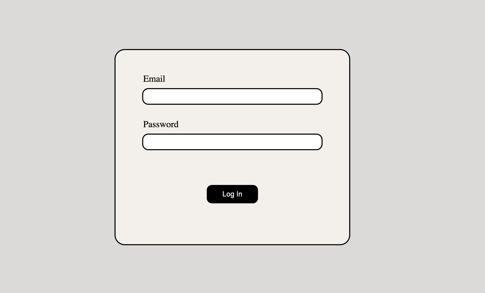

# MODULE-2-PART-6-gallery #


MODULE-2-PART-6-gallery - it's a fullstack application for watching cool disco pictures!

## Project Status ##

In progress

## Technologies ##

* HTML5
* CSS3
* JavaScript
* TypeScript
* NodeJS
* Express
* MongoDB, Mongoose

## Project Structure ##

```
MODULE2_PART6_GALLERY
|
|__build
|       |__backend
|
|
|__frontend
|         |__src
|         |__package.json
|         |__tsconfig.json
|
|__backend
          |__public
          |__views
          |__src
          |__package.json
          |__tsconfig.json

```

## Usage ##

1. Download project folder

2. Run `npm run start` command

3. Enter `localhost:8000` in your browser search bar

4. You have to log in. After filling the fields in click log in button to authorize



5. You can navigate through pages using this simple links bar


6. Enjoy!

## Authors and contacts ##

``name``: Kirill Temnyi

``email``: [kirik201100@gmail.com](mailto:kirik201100@gmail.com)


